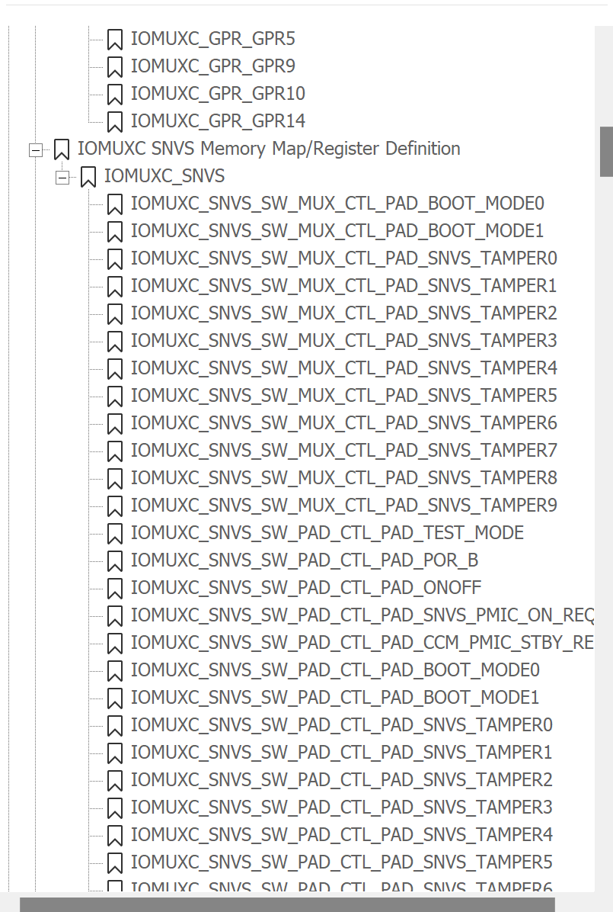
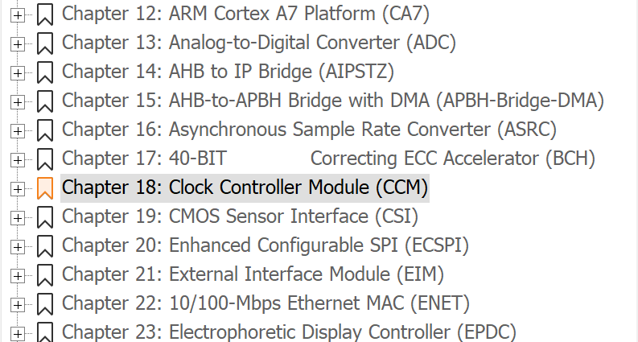
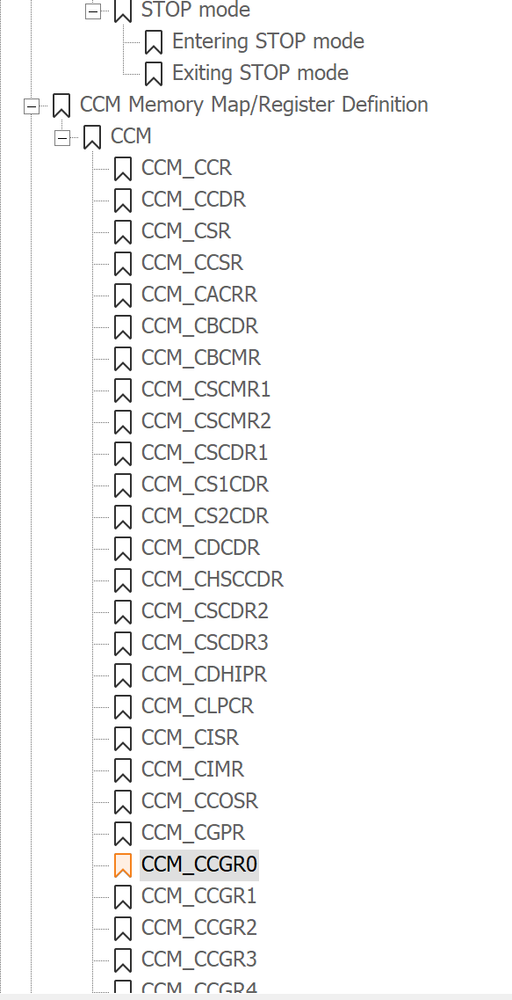
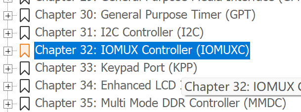
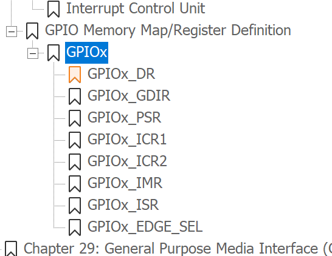
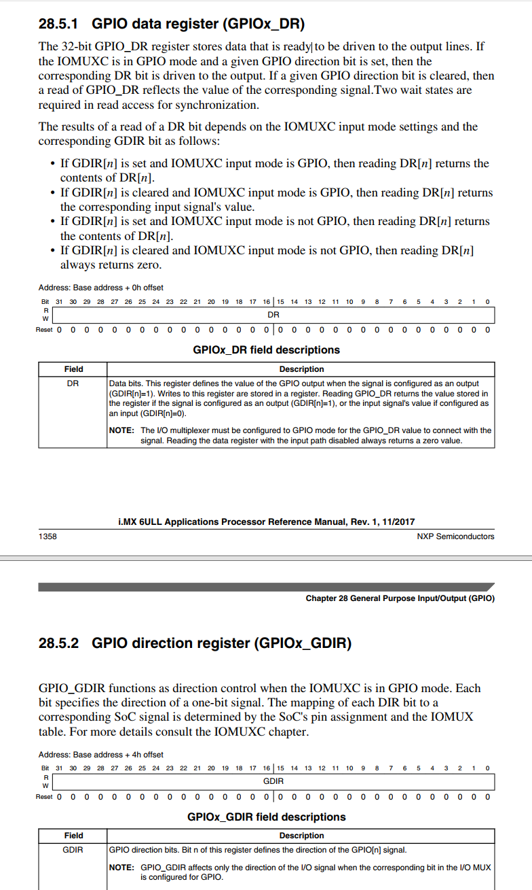

## 1.IO功能

### 1.1管脚命名

PAD_BOOT_MODE0

### 1.2管脚复用

复用配置：IOMUXC_SNVS_SW\_**MUX**\_CTL_PAD_BOOT_MODE0  

电器特性：IOMUXC_SNVS_SW\_**PAD**\_CTL_PAD_BOOT_MODE0  

查看管脚复用步骤：

1. 打开参考手册（Reference Manual）

2. 找到32章，IOMUXC章节

3. 目录里面找需要的管脚

## 2. 汇编裸机开发

### 2.1 为什么要汇编

​	① 初始化外设

​	② 使用汇编初始化ddr，但是i.MX6ULL不需要

​	③ 设置SP指针，一般指向ddr，设置好C语言运行环境

### 2.2 led硬件原理分析

2.2.1 stm32 IO初始化流程

​	① 使能GPIO时钟

​	② 使用IO复用，复用为GPIO

​	③ 配置GPIO电气属性

​	④ 使用GPIO

2.2.2 stm32 IO初始化

​	① 使能时钟，CCGR0-CCGR6控制所有外设时钟使能，为了简单，都将他们设置为0xFFFFFFFF

​			找到CCM（clock controller module）

​				

​	② 使用IO复用，复用为GPIO

​	③ 配置GPIO电气属性，包括压摆率、速度、驱动能力、开漏、上下拉等

​	④ 配置GPIO功能，设置输入输出。设置GPIOx_DR和GPIOx_GDIR

